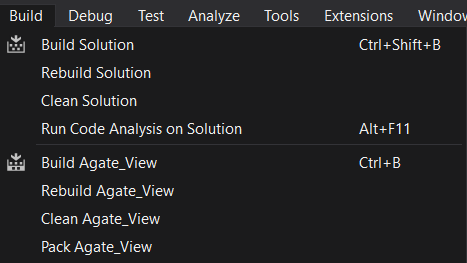

# ASP .Net Core School Application - Agate Exercise 01

My exercise project with ASP .NET Core in [Agate](https://agate.id/) Internship. This app is a CRUD application of a School that based on many forms, they are Web MVC Appliaction and API Application (separated into two projects, these are normal/basic API and [OData](https://www.odata.org/) (Open Data) protocol API).

## Solution Structure

---------
I classify my program solution into five separate projects, they are

1. Agate_Model - General model for this solution
2. Agate_API  - Basic API Application
3. Agate_View  - MVC Application
4. Agate_Odata - OData-based API Application
5. Agate_Test - Unit Test with XUnit

## Data Model

---------
In this app, I made two entities with EF Core, that translated into two tables in MySQL, they are

1. Student
   * asd
   * sad
2. Class
   * asd
   * sad

Student and Class entity have one-to-many relationship, that every class has many students, but a student only join one class. 

## Feature Used

---------
In this exercise app, I have learned and implemented these
1. JSON Data Format with the Serialization & Deserialization of Data
2. Dependency Injection
3. Routing & Middleware
4. Database (with In-memory and MySQL DB) & LINQ (Language-Integrated Query)
5. Migration & Data Seeding
6. Multiple Software Environment (Development, Debug, Staging, Sandbox, Release)
7. User App Secret
8. MVC (Model-View-Controller) Architecture
9. View Rendering & Tag Helper
10. HTTP Request (API's data fetching)
11. HTTP Context Modifying
12. Authentication (with ASP .NET Core Identity Library)
13. Localization & Globalization
14. OData (Open Data) Protocol
15. Swagger (an API Documenting Library)
16. Unit Test (with XUnit Library)

## Requirement
--------------
Before you run this app, you should have these application
1. [Visual Studio](https://visualstudio.microsoft.com/) - To compile and start the app
2. Web Browser (such Mozilla, Chrome, etc) - To use/operate MVC app
3. API Development App (such as [Postman](https://www.postman.com/) or [Insomnia](https://insomnia.rest/) - To use/operate API app

## How to Compile and Start
-----
1. Open Visual Studio, then open the solution with it.
2. *Optional step*, select **clean the solution** from **Build** menu 
3. Select **Build the solution** or **Rebuild the solution** from **Build** menu 
   
4. Select the App that you want to run/start from the toolbar (you can try to select to run multiple project too)
5. Then run the project by select green play button beside it (or you can try to select it from **Debug** menu) 
   
6. After runned successfully, open/operate the app by use web browser or API dev app.

## How to Use
--------
To use this solution, it's separate per project, so these are the steps
1. Agate_API
   1. sads
   2. sadsa
   3. sad
2. Agate_View
   1. sads
   2. sadsa
   3. sad
3. Agate_Odata
   1. sd
   2. sad
4. Agate_Test
   1. sads
   2. sad
